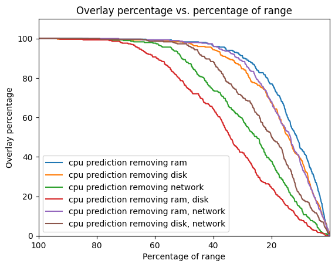

# overlay_dx reference implementation

Overlay_dx is a visual based metric aimed to support forecasting evaluation. This repository provides multiple forecasting approaches along with other evaluation metrics to provide a benchmark tool for the overlay_dx metric efficiency. Also, various models and algorithms for analyzing and predicting time series data as well as additional tools are provided. 

  
## Features
- Multiple forecasting models
- Evaluation metrics (including overlay_dx)
- Ensemble learning methods
  
## Installation

To install this project, ensure that you have Python 3.6 or higher installed. Use the following command to install the library and its dependencies:

```schell
pip install requirements.txt
```
  
## Usage

This project contains two sub-packages:  
src/models  
src/processing_forecasts  


This project provides the following forecasting models under the import:  
```python
from src.models.lstm import lstm
from src.models.cnn import cnn
from src.models.gru import gru
from src.models.sarima import sarima
from src.models.XGBoost import xgboost
from src.models.var import var
 ```
- LSTM: Long Short Term Memory, LSTM is a type of recurrent neural network (RNN) that can learn long-term dependencies between time steps of sequence data.
- CNN: Convolutional Neural Network, CNN is a type of neural network that can be used for time series forecasting by using convolutional layers.
- GRU: Gated Recurrent Unit, is a simplified version of LSTM that is also used for time series forecasting.
- VAR: Vector Auto Regression, VAR is a multivariate forecasting algorithm that is used when two or more time series influence each other.
- SARIMA: Seasonal Auto Regressive Integrated Mooving Average, SRIMA is an extension of ARIMA that supports the direct modeling of the seasonal component of the series.
- XGBoost: XGBoost is a decision-tree-based ensemble Machine Learning algorithm that uses a gradient boosting framework.
  
This project provides the following forecast evaluation metrics under the import :  
```python
from src.processing_forecasts.metrics import Evaluate
evaluation = Evaluate(target_values = true_values, prediction = forecast_values)

```
- MAE: Mean Absolute Error, MAE is the average of the absolute difference between the forecasted values and the actual values.
- MSE: Mean Squared Error, MSE is the average of the squared difference between the forecasted values and the actual values.
- RMSE: Root Mean Squared Error, RMSE is the square root of the average of the squared difference between the forecasted values and the actual values.
- MAPE: Mean Absolute Percentage Error, MAPE is the average of the absolute percentage difference between the forecasted values and the actual values.
- MASE: Mean Absolute Scaled Error, MASE is the mean absolute error of the forecast values divided by the mean absolute error of the in-sample one-step naive forecast.

This project also provides tools to reach the best possible forecast by combining different models outputs under the imports:
 ```python
from src.processing_forecasts.ensemble_learning import ensemble_learning
from src.processing_forecasts.multi_objective_optimization import find_best_weights
 ```  
 - Bagging: multiple independent models are trained on different subsets of the training data, and their predictions are combined through averaging, voting or weighted averaging (Random Forest).
 - Stacking: multiple models with different characteristics are trained and their predictions are combined using a meta-model(Decision Tree Regressor). 
 - Boosting: multiple models are trained sequentially, with each new model attempting to correct the errors made by the previous models (Gradient Boosting algorithm).
 - Multi objective optimization: find the best weighted average in regard of multiple metrics to minimize or scores to maximize.

This project also introduces a new forecast evaluation metric:  
 ```python
evaluation = Evaluate(target_values = true_values, prediction = forecast_values)
values, areas = evaluation.overlay_dx_visualisation_df(forecasts_df = forecast_df, max_percentage = 100, min_percentage= 0.1, step = 0.1)
 ```  


Overlay_dx is a score associated with a visualisation that provides a better understanding of the performance of our forecasts. Overlay_dx consists of several measures of the overlay metric, which draws an interval around the target values and returns the percentage of forecast values that fall within this interval. Overlay_dx calculates different measures of the overlay metric by reducing the size of its interval.  
    
A score of 77% represents how well the forecasted values align with the actual values at different thresholds. It indicates that the achieved score is 77% of the maximum possible score, where perfect alignment would occur at all thresholds.  
  
The score reflects the overall accuracy relative to the ideal scenario. The higher the score, the better the alignment between forecasted and actual values, while a lower score suggests larger deviations.  
  
The overlay curve visualization is the key advantage of this metric. It allows for a quick assessment of model performance. By observing the curve, you can easily identify where significant deviations from the ideal scenario occur, helping to point areas for improvement.  
  
Unlike other metrics, such as Mean Absolute Error, the overlay curve is less impacted by outliers, providing a more comprehensive view of accuracy.
In summary, the overlay curve offers an intuitive and concise way to evaluate model performance, providing insights into accuracy across different thresholds and highlighting areas for optimization.


```python
help(lstm)
help(lstm.forecast)
```

## Examples

Here are a few examples to demonstrate how to use this project, a demo notebook is available for more detailed usage examples.

Example command for using lstm model with specific parameters:

```python
# initialise the lstm model with its parameters
lstm_model = lstm(df = df, target = "Close", test_size = 0.2, plot_learning_curves_bool = True)
# train and test the model accordingly to the provided test_size using the fit method
forecast, test_values = lstm_model.fit()
# use the forecast method to make new predictions with the trained model
predictions = lstm.forecast(X_val = new_data)
```

## Documentation

For detailed documentation and further information, please refer to the official documentation.
  
## Contributing

Contributions are welcome! If you find any issues or have suggestions for improvement, please open an issue or submit a pull request on the GitHub repository.

## License

This project is licensed under the MIT License.

Thank you for using overlay_dx! We hope this library helps you in your time series forecasting tasks. If you have any questions or need assistance, please don't hesitate to reach out.
